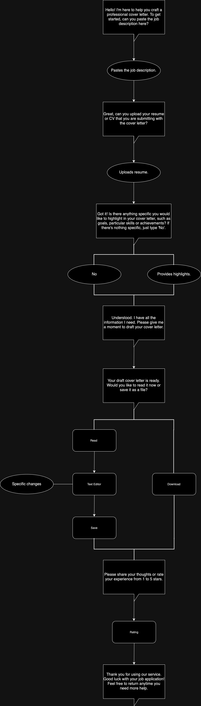

# cover-letter-chatbot
This is a chatbot that helps you write a cover letter. It is built using the Rasa framework.

Overview:
Purpose: To help users write a cover letter.
Intended users: Job seekers.
Problems: Writing a cover letter can be time-consuming and challenging. Simply using Generative models like GPT-3 may not be enough as it may not be tailored to the job description.

Dialogue Flow:
made with draw.io

- Input: Job description, resume, and additional highlights.
- Output: A customized cover letter.